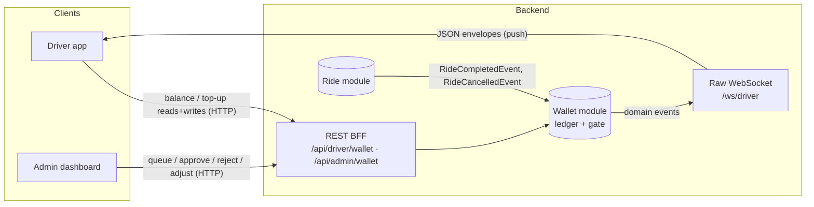
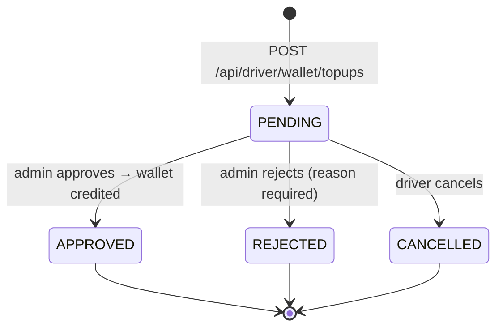
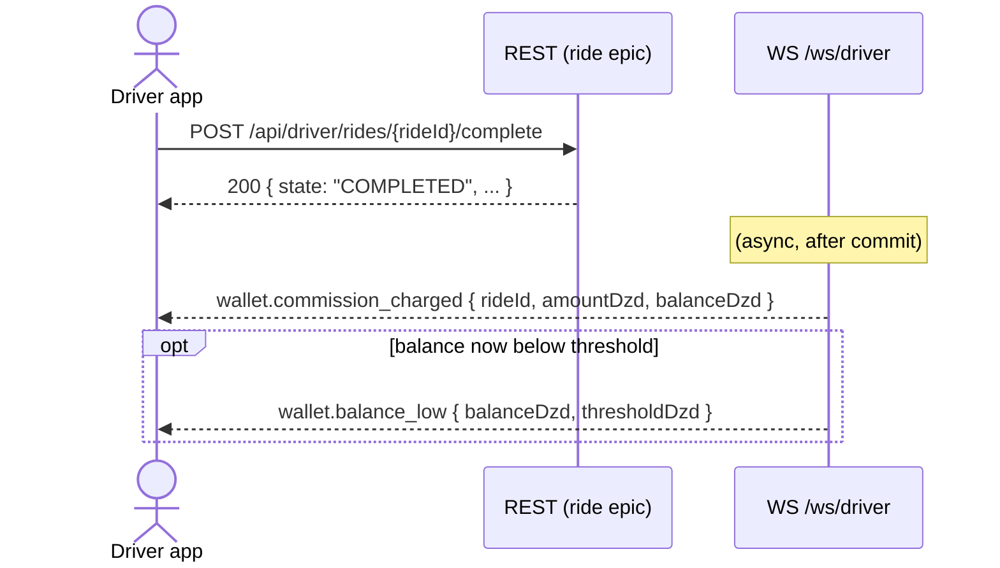
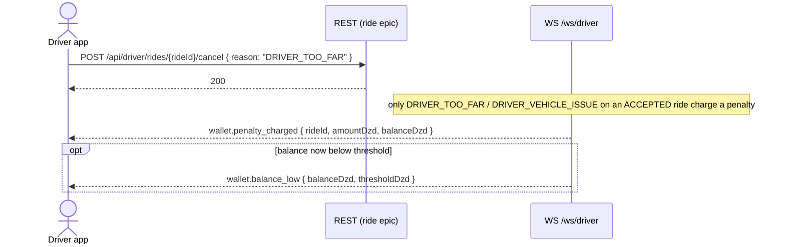
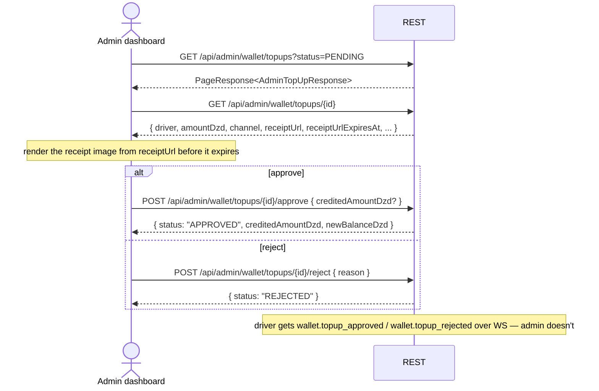

# Epic 04 — Wallet: Mobile & Admin Integration Runbook

**Audience:** Flutter developers integrating the **driver app**'s wallet screens, and web developers
integrating the **admin dashboard**'s top-up queue and driver wallet tab.

**What this is:** the end-to-end *flow* — which REST call to make when, what arrives over the
WebSocket and in what order, the state machine, and how the balance gate interacts with the ride
app you already integrated in [`epic-03-ride.md`](epic-03-ride.md). It is the glue Swagger can't
show you.

**What this is NOT:** an exhaustive field reference. Swagger (`/swagger-ui.html`) and
`docs/api/driver.md` / `docs/api/admin.md` are the field-level contract. When this doc shows a
payload it is illustrative; the live schema wins.

> ⚠️ **No passenger money moves here.** Rides stay cash — the passenger pays the driver in the car.
> The wallet only holds the **driver's pre-paid platform commission**. If you're looking for fare
> payment / in-app checkout, it doesn't exist in this epic.

---

## 1. Conventions

| Thing | Rule |
|---|---|
| Money | All amounts are **whole DZD integers** (e.g. `2000` = 2000 DZD). No minor units, no decimals. |
| Time | All timestamps are **ISO-8601 UTC**. |
| IDs | All IDs are **UUID** strings. |
| Source of truth | Same as the ride epic: **REST is authoritative state, WS is best-effort push.** On (re)connect, refetch `GET /api/driver/wallet` (+ `/transactions`, `/topups`), then let WS drive incremental updates. |
| Auth | Driver calls carry a mobile JWT (`Authorization: Bearer <accessToken>`); admin calls carry an admin JWT — see [§3](#3-auth--tokens). |
| Idempotency | **Unlike the ride epic, no wallet mutation accepts an `Idempotency-Key` header.** Submit/approve/reject/cancel are each naturally guarded (state transitions, a partial-unique "one PENDING per driver" index), so an accidental retry 409s instead of double-acting. **The one exception is admin manual adjustment** — every call posts a **new, distinct** ledger row by design (so an admin can issue two separate corrections back to back). Debounce that button; a double-tap is a double adjustment, not a safe retry. |
| Pagination | List endpoints return the shared `PageResponse<T>` envelope: `{ data: T[], page, size, totalElements, totalPages }`. |

---

## 2. Architecture at a glance



Two things to internalize:

- **The admin dashboard has no WebSocket** (same as the ride epic — "admin: none in v1"). It polls
  REST. Only the **driver app** receives wallet WS pushes.
- **Two of the four wallet-affecting actions are not driver-initiated at all.** Commission
  settlement and the cancellation penalty are triggered by *ride* events (completion / driver
  cancel) that the driver app already causes through the ride API — the wallet reacts on the
  backend and pushes the result. There is no "charge commission" button; the balance just changes
  and a WS event tells you why.

---

## 3. Auth & tokens

| Surface | Token | How obtained |
|---|---|---|
| Driver app | Mobile JWT (`iss=vtc-app`, `aud=vtc-mobile`, `activeRole=DRIVER`) | Same OTP flow as the ride epic — see `docs/api/auth.md`. |
| Admin dashboard | Admin JWT (`iss=vtc-admin`, `aud=vtc-admin-dashboard`) | **Email + password**, not OTP — `POST /api/admin/auth/login`. Separate RSA key pair from the mobile chain. |

All wallet routes require auth — none are `permitAll`. `/api/driver/wallet/**` sits behind the
driver security chain (reuses the same token as ride); `/api/admin/wallet/**` behind the admin
chain.

---

## 4. REST endpoints

### Driver app (`/api/driver/wallet`)

| Method | Path | Purpose | Notes |
|---|---|---|---|
| `GET` | `/` | Current balance + gate status | `{ balanceDzd, minOnlineBalanceDzd, belowGate }`. **Get-or-create** — a freshly-KYC'd driver reads `0` instead of `404`. |
| `GET` | `/transactions?page&size` | Paginated ledger, newest-first | `WalletTransactionResponse { id, type, amountDzd, balanceAfterDzd, sourceType, sourceRef, note, createdAt }`. `amountDzd` is **signed** (negative for debits). |
| `POST` | `/topups` | Submit a manual top-up | **`multipart/form-data`**, not JSON: fields `amountDzd` (string), `channel` (`CASH` \| `BANK_TRANSFER`), `receipt` (file, required — jpeg/png/pdf, ≤5 MB). Returns `201` with the new `PENDING` request. |
| `GET` | `/topups?status&page&size` | The driver's own top-up history | `status` filter optional. |
| `POST` | `/topups/{id}/cancel` | Cancel a request you submitted | Only while `PENDING` → `204`. |

### Admin dashboard (`/api/admin/wallet`)

| Method | Path | Purpose | Notes |
|---|---|---|---|
| `GET` | `/topups?status&driverId&q&startDate&endDate&page&size` | The top-up queue | All filters optional; `q` matches driver name/phone. |
| `GET` | `/topups/{id}` | Top-up detail | Includes a **presigned** `receiptUrl` + `receiptUrlExpiresAt` — treat as short-lived; don't cache past expiry. |
| `POST` | `/topups/{id}/approve` | Approve, credit the wallet | Body `{ creditedAmountDzd? }` — **omit or `null` to credit the requested amount as-is**; set it to override (e.g. the receipt shows a different amount than typed). Returns `{ id, status, creditedAmountDzd, newBalanceDzd }`. |
| `POST` | `/topups/{id}/reject` | Reject with a reason | Body `{ reason }` — **mandatory, free text**, shown to the driver. |
| `GET` | `/{userId}?page&size` | A driver's wallet tab | `{ balanceDzd, transactions: PageResponse<...> }`. |
| `POST` | `/{userId}/adjust` | Manual credit/debit | Body `{ direction: "CREDIT"\|"DEBIT", amountDzd, reason }` — `reason` mandatory. **Not idempotent** — see [§1](#1-conventions). |

> **Known gap:** neither `GET /topups` (queue) nor `GET /topups/{id}` (detail) currently return
> `creditedAmountDzd` / `decisionReason` / `decidedAt` for an already-decided request — only the
> **driver's own** `GET /wallet/topups` exposes those. If your admin UI needs to show "credited
> 1800 DZD, reason: partial receipt" after the fact, it isn't in the admin response today; flag
> this to backend if the dashboard needs it.

---

## 5. WebSocket: wallet events (driver only)

Reuses the **same** `/ws/driver` socket and envelope from the ride epic
(`{ type, payload, timestamp, clientMessageId }`) — don't open a second connection. See
`epic-03-ride.md §4` for the handshake, heartbeat, reconnect, and token-refresh mechanics; they're
unchanged here.

| `type` | `payload` | When |
|---|---|---|
| `wallet.topup_approved` | `{ topUpId, creditedAmountDzd, balanceDzd }` | Admin approved your top-up. |
| `wallet.topup_rejected` | `{ topUpId, reason }` | Admin rejected your top-up. |
| `wallet.commission_charged` | `{ rideId, amountDzd, balanceDzd }` | A ride you completed was settled. `amountDzd` is the **positive** commission amount debited (check the ledger's signed `amountDzd` for the actual `-` sign). |
| `wallet.penalty_charged` | `{ rideId, amountDzd, balanceDzd }` | You cancelled a ride post-accept with a driver-fault reason. |
| `wallet.balance_low` | `{ balanceDzd, thresholdDzd }` | **May follow immediately after** `commission_charged` or `penalty_charged` on the *same* debit, if it pushed you below `minOnlineBalanceDzd`. Expect up to two events back-to-back for one ride. Not sent on credits (top-ups never trigger this). |
| `wallet.balance_adjusted` | `{ direction, amountDzd, newBalanceDzd }` | Admin manually credited/debited you. |

There is **no upstream (client → server) wallet message** — unlike `driver.location` on the ride
socket, the driver app only ever *receives* on this channel for wallet purposes.

---

## 6. Top-up state machine



All three exits are terminal — a decided request can't be re-submitted; the driver must start a
new top-up. Only **one `PENDING` request per driver** is allowed at a time
(`409 TOPUP_PENDING_EXISTS` on a second submit).

---

## 7. The balance gate

This is the part that touches the **ride** app you already built. `WalletPort.hasMinimumBalance` is
checked at **two** separate points, both outside this epic's own endpoints:

| Where | Endpoint | Error on failure |
|---|---|---|
| Going online | `POST /api/driver/availability/online` (ride epic) | `403 INSUFFICIENT_WALLET_BALANCE` |
| Placing a bid | `POST /api/driver/rides/{rideRequestId}/bid` (ride epic) | `403 INSUFFICIENT_WALLET_BALANCE` |

There is **no mid-session force-offline** — an already-online driver whose balance drops below the
threshold mid-shift is *not* kicked offline; the gate only blocks the *next* go-online or bid
attempt. Read `belowGate` off `GET /api/driver/wallet` to decide whether to gray out the "Go
online" button proactively, rather than waiting for a `403`.

```mermaid
sequenceDiagram
    actor D as Driver app
    participant R as REST

    D->>R: GET /api/driver/wallet
    R-->>D: { balanceDzd: 0, minOnlineBalanceDzd: 500, belowGate: true }
    Note over D: gray out "Go online"; show "Top up to activate"

    D->>R: POST /api/driver/wallet/topups (multipart + receipt)
    R-->>D: 201 { id, status: "PENDING" }
    Note over D: admin acts out of band — no more driver action needed

    Note over D: (WS) wallet.topup_approved { balanceDzd: 2000 }
    D->>R: GET /api/driver/wallet
    R-->>D: { balanceDzd: 2000, belowGate: false }
    D->>R: POST /api/driver/availability/online
    R-->>D: 200
```

**Negative balance is allowed and expected — it's driver debt, not a bug.** Commission and penalty
debits always post even if they drive the balance below zero (the cash ride is already paid; the
platform still needs its cut). The driver just stays gated from going online/bidding until a
top-up brings the balance back above the threshold. Don't build any "balance can't go negative"
validation on the client.

---

## 8. Automatic settlement (push-only — no driver REST call)

These two flows are **entirely backend-triggered** by actions the driver already performs on the
*ride* API. Nothing new to call — just something new to listen for.





Practical implication for the UI: after a `complete` or a driver-fault `cancel` call succeeds, **do
not assume the balance shown on screen is still current** — either refetch `GET /api/driver/wallet`
right after, or update the balance tile reactively when the WS event lands (preferred, since the
event carries the new balance already).

---

## 9. Admin flow



Every approve/reject/adjust writes an `audit_logs` row (`APPROVE_TOP_UP` / `REJECT_TOP_UP` /
`ADJUST_WALLET_BALANCE`) — visible on the existing admin audit log screen, not part of this API.

---

## 10. Error handling

Same envelope as the rest of the app: `{ "error": { "code", "message", "details?" } }`.

| Code | HTTP | When | Client should |
|---|---|---|---|
| `INSUFFICIENT_WALLET_BALANCE` | 403 | Go-online or bid below `minOnlineBalanceDzd` | Prompt to top up; see [§7](#7-the-balance-gate). |
| `TOPUP_BELOW_MINIMUM` | 400 | Submitted amount `< topup.min-dzd` | Show the minimum inline (surface it from a config/reference endpoint if you have one, or from a previous `TOPUP_BELOW_MINIMUM` `details`). |
| `TOPUP_RECEIPT_REQUIRED` | 400 | Missing / oversized (>5 MB) / wrong-mime receipt | Require a jpeg/png/pdf attachment before enabling submit. |
| `TOPUP_PENDING_EXISTS` | 409 | Driver already has a `PENDING` request | Route to the existing pending request instead of showing a new form. |
| `TOPUP_NOT_PENDING` | 409 | Cancel/approve/reject on an already-decided request | Refetch and re-render — your view is stale. |
| `TOPUP_NOT_FOUND` | 404 | Unknown top-up id | Refetch the list. |
| `WALLET_NOT_FOUND` | 404 | Admin wallet-view for a non-driver user | Shouldn't happen from a driver-detail screen; guard the entry point. |
| `INVALID_WALLET_ADJUSTMENT` | 400 | Adjust with non-positive amount or blank reason | Client-side validate before submit. |
| `STORAGE_UNAVAILABLE` | 503 | MinIO unreachable while uploading/presigning a receipt | Retry; surface as "receipt storage temporarily unavailable." |
| `UNAUTHORIZED` | 401 | Missing/expired token | Refresh (driver) or force re-login (admin — no silent refresh flow documented here). |

General rule, same as the ride epic: **409s mean "your view is stale" — refetch and re-render**,
don't show a scary error dialog.

---

## 11. Client implementation checklist

**Driver app:**

- [ ] Read `belowGate` from `GET /wallet` to gray out "Go online" *before* the user taps it, not
      just to catch the `403`.
- [ ] Top-up submit is `multipart/form-data`, not JSON — remember the receipt file is mandatory.
- [ ] After `ride .../complete` or a driver-fault `ride .../cancel`, expect the balance to change
      via WS (`wallet.commission_charged` / `wallet.penalty_charged`), possibly followed by
      `wallet.balance_low` — update the balance tile from the event payload rather than polling.
- [ ] Don't validate against negative balances client-side — negative is valid (debt).
- [ ] No `Idempotency-Key` on `POST /topups` — rely on the `TOPUP_PENDING_EXISTS` 409 rather than
      trying to dedupe client-side.

**Admin dashboard:**

- [ ] No WebSocket for admin — poll `GET /topups?status=PENDING` for the live queue count.
- [ ] `receiptUrl` is presigned and **expires** — don't cache it across a long-open detail modal;
      refetch the detail if the user leaves it open past `receiptUrlExpiresAt`.
- [ ] Debounce the **adjust** button specifically — every click is a new, separate ledger entry,
      unlike approve/reject/cancel which are naturally guarded.
- [ ] `creditedAmountDzd` in the approve request is optional — only send it when the admin
      explicitly overrides the amount; omit/`null` to credit as requested.

---

## 12. Reference pointers

| Need | Where |
|---|---|
| Field-level REST contracts (live) | `/swagger-ui.html` |
| Driver REST + WS event tables | `docs/api/driver.md` |
| Admin REST tables | `docs/api/admin.md` |
| WebSocket protocol (envelope, auth, refresh, close codes) — shared with the ride epic | `docs/api/websocket.md`, `epic-03-ride.md §4` |
| Full error-code catalog | `docs/07-error-codes.md` |
| Commission / penalty / gate mechanics | `docs/modules/07-wallet.md`, `docs/03-core-system-mechanics.md` |
| Env-var / config defaults (`min-online-balance-dzd`, `topup.min-dzd`, commission matrix, etc.) | `docs/08-environment-config.md` |
| Runnable backend verification (curl-level, not for FE) | `flows/wallet-balance-gate-topup-and-settlement.md` |
